Bayesian Inference
================

This notes brings the important preliminaries for Bayesian Inference.
---------------------------------------------------------------------

-   Knowing the role and meaning of the parameters in a theoretical distribution
-   Computation of Summaries of a distribution, particularly percentiles
-   Aspects of closed form integration (involving univariate functions)
-   Monte Carlo integration
-   Illustrating Simulation functions available in R and compariosn with other appraoches
    -   Simple distributions like Binomial, Beta, Uniform are used.
-   Bayes Formula in discrete case

Functional forms and effect of location / shape parameters<br>
==============================================================

This part helps to visulize the shape and the effect of shifting origin

``` r
x1=runif(100,2,5)
x=seq(from=-2,to=2,by=0.01) #sort(x1,decreasing = FALSE)
#power / exponential
plot(x,x^2,type="l",col="red")
lines(x,2^x)

par(mfrow=c(1,2))
plot(x,x^2,type="l",col="red")
lines(x,2^x)
plot(x,exp(-x),type="l",col="blue")

par(mfrow=c(2,2))
plot(x,x^2,type="l",col="red")
lines(x,2^x)
plot(x,exp(-x),type="l",col="blue")
plot(x,x^2*exp(-x),type="l",col="green")
plot(x,x^2*exp(-x^2),type="l",col="violet")
```


``` r
#Location shifting
par(mfrow=c(2,2))
plot(x,x^2,type="l",col="red")
lines(x,(x-2)^2)

plot(x,exp(-x^2),type="l",col="red")
lines(x,exp(-(x-0.5)^2))

plot(x,x^2*exp(-x^2),type="l",col="violet")
lines(x,x^2*exp(-(x-1)^2))

#Shape
par(mfrow=c(2,2))
```


``` r
plot(x,x^2,type="l")
plot(x,x^3,type="l")
plot(x,1/x,type="l")
plot(x,1/x^3,type="l")
```


``` r
par(mfrow=c(2,2))
plot(x,exp(-x),type="l")
plot(x,exp(-2*x),type="l")
plot(x,exp(-3*x),type="l")
plot(x,exp(-x/2),type="l")
```

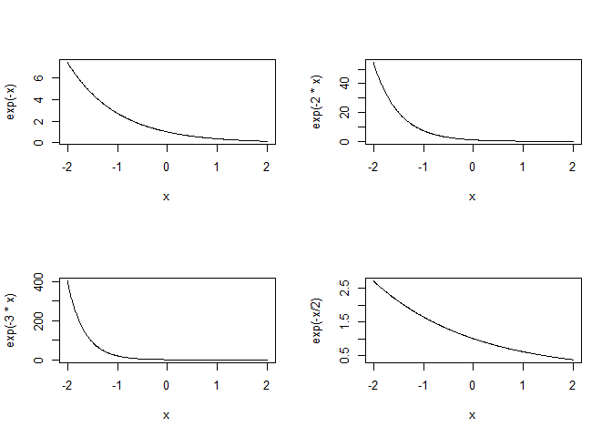

Finding percentiles *p*\[*X* ≤ *x*<sub>*α*</sub>\]=*α* -Example beta distribution

``` r
require(pracma)
```

    ## Loading required package: pracma

``` r
a=2
b=5
f1<-function(q) {(1/beta(a,b))*q^(a-1)*(1-q)^(b-1)}
aa=seq(0,1,by=0.0001)
k1=length(aa)
s=0
for(i in 1:k1)
{
  s[i]=integral(f1,0,aa[i])
}
qu=0.025      #Required percentile
ep=0.0000001 #Required Precision
qq=max(which(s-qu < ep))
aa[qq] #req_percentile
```

    ## [1] 0.0432

``` r
curve(f1)
abline(v=aa[qq],col="red")
```

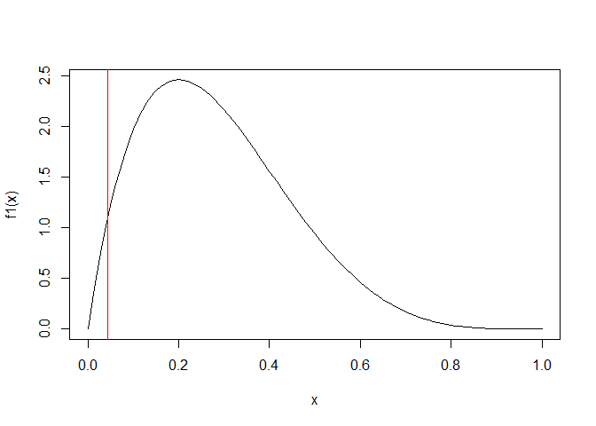

Summary of a RV - mean, variance, maximum, minimum,percentiles...
=================================================================

E\[g(x)\] = integral of g(x) and f(x) wrto x over the range of x<br> If g(x)=x we get mean, if g(x)=x^2 and V(x)=E\[X^2\]-E\[x\]^2 is variance, Here f(x) is a pdf of the RV <br>

``` r
require(pracma)
a1=0.5 # a and b should be positive constants
b1=0.5
f1<-function(y) {y*(1/beta(a1,b1))*y^(a1-1)*(1-y)^(b1-1)}
f2<-function(y) {y^2*(1/beta(a1,b1))*y^(a1-1)*(1-y)^(b1-1)}
mo1=integral(f1,0,1)
mo2=integral(f2,0,1)
va=mo2-mo1^2
cbind(mo1,va)
```

    ##      mo1    va
    ## [1,] 0.5 0.125

Percentiles quantiles are cutpoints dividing the range of a probability \#distribution into contiguous intervals with equal probabilities, or dividing the observations in a sample in the same way. <br> There is one \#less quantile than the number of groups created.Percentiles are quantiles that divide a distribution into 100 equal parts<br>

``` r
a2=5
b2=6
p_df<-function(q) {(1/beta(a2,b2))*q^(a2-1)*(1-q)^(b2-1)}
aa=seq(0,1,by=0.0001)
k1=length(aa)
s=0
for(i in 1:k1)
{
  s[i]=integral(p_df,0,aa[i])
}
qu=0.25             #Required percentile
ep=0.0000001    #Required Precision
qq=max(which(s-qu < ep))
aa[qq] #req_percentile
```

    ## [1] 0.3506

``` r
curve(p_df)
abline(v=aa[qq])
```


Bayes formula for discrete case<br>
===================================

``` r
theta=c(0.1,0.25,0.5,0.75,0.9,0.99)                  #Parameter values
pri_the=c(0.2, 0.1,0.3,0.2,0.1,0.1)                  #Priors
x=7                                     #No of success
n=7                                    #No of trials
marg=pri_the*dbinom(x,n,theta)          #marginal distribution
marg_sum=sum(pri_the*dbinom(x,n,theta))
theta_U=theta     #Req thetas to find posteriors- type theta for all priors or 0.25...
k=which(theta %in% theta_U)
pos_the=marg[k]/marg_sum
cbind(theta=theta[k],prior=pri_the[k],posterior=round(pos_the,5))
```

    ##      theta prior posterior
    ## [1,]  0.10   0.2   0.00000
    ## [2,]  0.25   0.1   0.00004
    ## [3,]  0.50   0.3   0.01378
    ## [4,]  0.75   0.2   0.15696
    ## [5,]  0.90   0.1   0.28121
    ## [6,]  0.99   0.1   0.54801

For general discrete events<br>
===============================

PROBLEM:<br> The chances of 10 employees becoming managers of a certain company are 0.06751937, 0.02554829, 0.10617217, 0.21419476, 0.130974, 0.04465979, 0.04332306, 0.11943548, 0.17432549, 0.07384759. The probabilities that each pass a screening test 0.3, 0.5, 0.8, 0.3, 0.5, 0.4, 0.3, 0.25, 0.45, 0.3 respectively.<br>

``` r
theta=c(1, 2, 3,4,5,6,7,8,9,10)                        #Parameter values
#pri_the=c(0.1,0.1,0.1,0.1,0.1,0.1,0.1,0.1,0.1,0.1) 
pri_the=c(0.06751937,   0.02554829, 0.10617217, 0.21419476, 0.130974,   0.04465979, 0.04332306, 0.11943548, 0.17432549, 0.07384759)       #Priors
#Data
p1=0.3                           #p(A/E1)
p2=0.5                            #p(A/E2)
p3=0.8                            #p(A/E3)
p4=0.3                           #p(A/E4)
p5=0.5                            #p(A/E5)
p6=0.4                            #p(A/E6)
p7=0.3                           #p(A/E7)
p8=0.25                            #p(A/E8)
p9=0.45                            #p(A/E9)
p10=0.3                            #p(A/E10)

d_p=c(p1,p2,p3,p4,p5,p6,p7,p8,p9,p10)                  #data_probabilities_Likelihood                               
marg_NR=pri_the*d_p           #marginal distribution
marg_sum=sum(pri_the*d_p)
pos_the=marg_NR/marg_sum

cbind(theta=theta,prior=pri_the,posterior=pos_the)
```

    ##       theta      prior  posterior
    ##  [1,]     1 0.06751937 0.04952115
    ##  [2,]     2 0.02554829 0.03123006
    ##  [3,]     3 0.10617217 0.20765468
    ##  [4,]     4 0.21419476 0.15709818
    ##  [5,]     5 0.13097400 0.16010177
    ##  [6,]     6 0.04465979 0.04367347
    ##  [7,]     7 0.04332306 0.03177470
    ##  [8,]     8 0.11943548 0.07299858
    ##  [9,]     9 0.17432549 0.19178492
    ## [10,]    10 0.07384759 0.05416249

``` r
plot(pri_the,pos_the,cex=1.5)
text(pri_the,pos_the,theta, cex=1, pos=4, col="red")
```

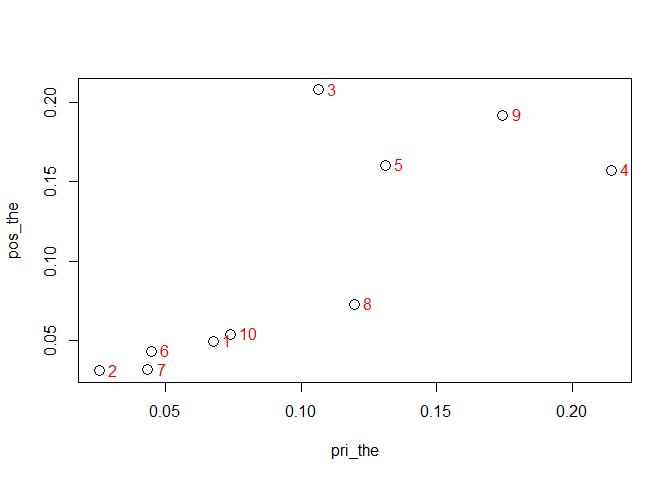

Generating discrete probabilities
=================================

``` r
theta=c(1, 2, 3,4,5,6,7,8,9,10)                        #Parameter values
k=length(theta)
pri_the1=runif(k,0,1)
pri_the= pri_the1/sum(pri_the1)      #Priors
#Data  #data_probabilities_Likelihood   
pd=0
for(i in 1:k)
{
  pd[i]=runif(1,0,1)
}
#marginal distribution
marg_NR=pri_the*pd           
marg_sum=sum(pri_the*pd)
pos_the=marg_NR/marg_sum
#Results
cbind(theta=theta,prior=pri_the,posterior=pos_the)
```

    ##       theta      prior   posterior
    ##  [1,]     1 0.17517490 0.047026564
    ##  [2,]     2 0.02042579 0.029446455
    ##  [3,]     3 0.03081199 0.089283548
    ##  [4,]     4 0.09133117 0.002791422
    ##  [5,]     5 0.14443569 0.302851230
    ##  [6,]     6 0.09076183 0.049873245
    ##  [7,]     7 0.11641572 0.101472720
    ##  [8,]     8 0.06140605 0.098259636
    ##  [9,]     9 0.10775289 0.171081684
    ## [10,]    10 0.16148397 0.107913496

``` r
plot(pri_the,pos_the,cex=1.5)
text(pri_the,pos_the,theta, cex=1, pos=4, col="red")
```

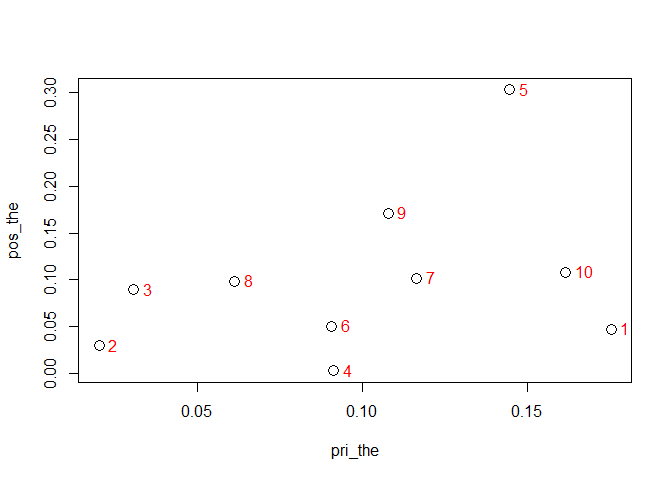

Maximum/Minimum
===============

``` r
a=0.5
b=0.5
p_df<-function(y) {(1/beta(a,b))*y^(a-1)*(1-y)^(b-1)}
mi=optimize(p_df,c(0,1))
mx=optimize(p_df,c(0,1),maximum = TRUE)
minimum=mi$objective
maximum=mx$objective
curve(p_df,col="Green")
abline(v=mx$maximum,col="blue")
abline(v=mi$minimum,lty=2,col="Red")
```

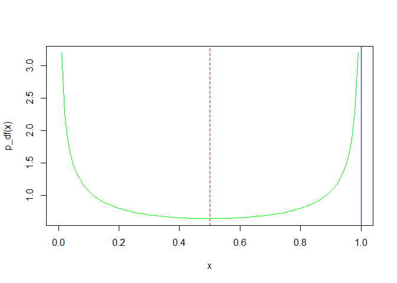

``` r
c(mi$minimum,minimum,mx$maximum,maximum)
```

    ## [1]  0.5000000  0.6366198  0.9999339 39.1508220

``` r
p_df(0.3)
```

    ## [1] 0.6946091

``` r
dbeta(0.3,a,b)
```

    ## [1] 0.6946091

``` r
integral(p_df,0,0.3)  
```

    ## [1] 0.3690101

``` r
pbeta(0.3,a,b)
```

    ## [1] 0.3690101

MC integration<br>
==================

This section illustrates Monte Carlo integration and compares with actual integration. The integrand is $\\frac {x^2}{(x^3+1)}$ First the number of simulation is 10

``` r
k=10 #No of simulation
fn<-function(x){x^2/(x^3+1)} #function to be integrated
LL=0              #Limits
UL=2
ri=runif(k,LL,UL) #Random generator
ri_s=sort(ri,decreasing=FALSE) #For graphing
ri1=fn(ri_s)      #Evaluation
par(mfrow=c(1,2))
plot(ri1,col="red")
curve(fn,from=LL, to=UL)
```

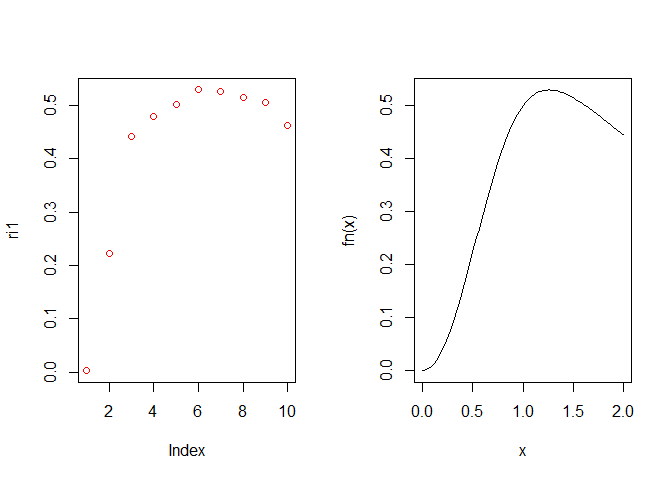

``` r
require(pracma)
integral(fn,LL,UL)    #actual integration
```

    ## [1] 0.7324082

``` r
(UL-LL)*sum(ri1)/k    #MC answer
```

    ## [1] 0.8372389

Simulation is increased to 100 then to 1000<br><br>
===================================================

The integrand is *s**i**n*<sup>2</sup>*x*
=========================================

``` r
k=100
fn<-function(x){sin(x)^2}
LL=0
UL=pi
ri=runif(k,LL,UL)
ri_s=sort(ri,decreasing=FALSE)
ri1=fn(ri_s)
par(mfrow=c(1,2))
plot(ri1,col="red")
curve(fn,from=LL, to=UL)
```

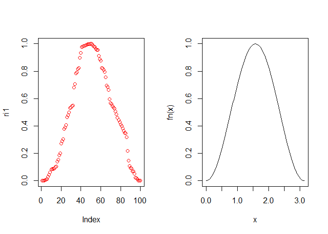

``` r
require(pracma)
integral(fn,LL,UL)
```

    ## [1] 1.570796

``` r
(UL-LL)*sum(ri1)/k
```

    ## [1] 1.509712

The integrand is *e*<sup>−2*x*</sup><br>
========================================

``` r
k=1000
fn<-function(x){exp(-2*x)}
LL=0
UL=10
ri=runif(k,LL,UL)
ri_s=sort(ri,decreasing=FALSE)
ri1=fn(ri_s)
par(mfrow=c(1,2))
plot(ri1,col="red")
curve(fn,from=LL, to=UL)
```

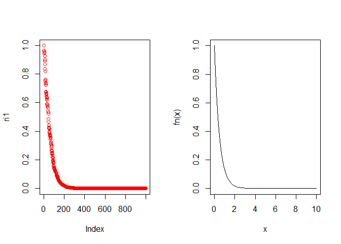

``` r
require(pracma)
integral(fn,LL,UL)
```

    ## [1] 0.5

``` r
(UL-LL)*sum(ri1)/k
```

    ## [1] 0.5546903

Integration using Beta distribution
===================================

``` r
k=10000 
a=2
b=3
fn<-function(y){(1/beta(a,b))*y^(a-1)*(1-y)^(b-1)}
#fn<-function(x){dbeta(x,a,b)}
LL=0.06758599
UL=0.8058796
ri=runif(k,LL,UL)
ri_s=sort(ri,decreasing=FALSE)
ri1=fn(ri_s)
par(mfrow=c(1,2))
plot(ri1,col="red")
curve(fn,from=LL, to=UL,lwd=2,col="blue")
```

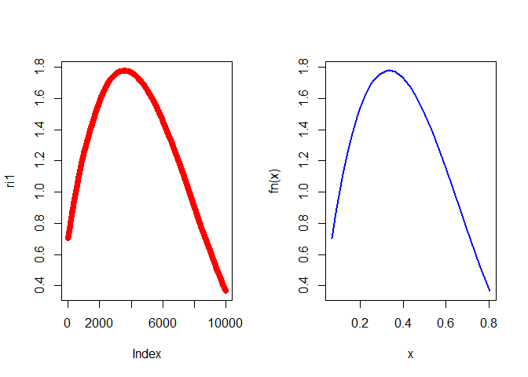

``` r
require(pracma)
integral(fn,LL,UL)
```

    ## [1] 0.95

``` r
(UL-LL)*sum(ri1)/k
```

    ## [1] 0.944493

``` r
#Check with
pbeta(UL,a,b)-pbeta(LL,a,b)
```

    ## [1] 0.95

Monte Carlo Simulation - U(0,1) behaviour<br>
=============================================

Generating different samples of varied sizes repeated 10 times<br> Mean and variance are calculated for subsamples - 10 in each case

``` r
x1=matrix(runif(50,0,1),5,10) #n - size - 50
x2=matrix(runif(100,0,1),10,10) #n - size - 100
x3=matrix(runif(500,0,1),50,10) #n - size - 500
x4=matrix(runif(2000,0,1),200,10)  #n - size - 2000
m1=0
for(i in 1:10)
{
m1[i]=mean(x1[,i])
}
m2=0
for(i in 1:10)
{
  m2[i]=mean(x2[,i])
}
m3=0
for(i in 1:10)
{
  m3[i]=mean(x3[,i])
}
m4=0
for(i in 1:10)
{
  m4[i]=mean(x4[,i])
}

v1=0
for(i in 1:10)
{
  v1[i]=var(x1[,i])
}
v2=0
for(i in 1:10)
{
  v2[i]=var(x2[,i])
}
v3=0
for(i in 1:10)
{
  v3[i]=var(x3[,i])
}
v4=0
for(i in 1:10)
{
  v4[i]=var(x4[,i])
}
```

Distribution of original data and mean and variance of subsamples of sizes 5, 10, 50, 200
=========================================================================================

``` r
par(mfrow=c(2,2))
boxplot(x1,col=2,main="n50")
boxplot(x2,col=3,main="n100")
boxplot(x3,col=4,main="n500")
boxplot(x4,col=5,main="n2000")
```

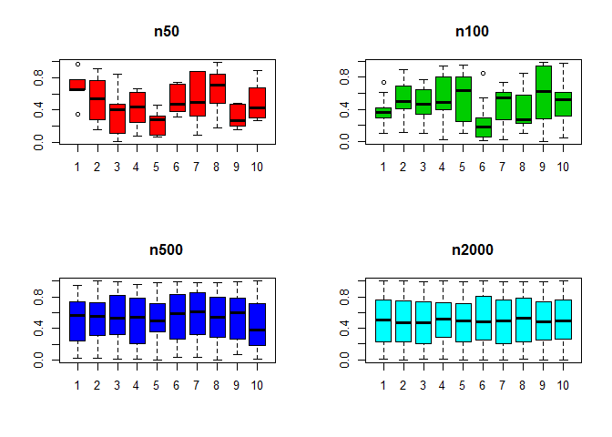

``` r
cbind(m1,m2,m3,m4)
```

    ##              m1        m2        m3        m4
    ##  [1,] 0.6816298 0.3901874 0.4895038 0.4991358
    ##  [2,] 0.5295556 0.5269546 0.5339377 0.4851703
    ##  [3,] 0.3691380 0.4672654 0.5440718 0.4737527
    ##  [4,] 0.4072804 0.5421453 0.5039354 0.5086147
    ##  [5,] 0.2429358 0.5623620 0.5119755 0.4730776
    ##  [6,] 0.5272038 0.2492692 0.5468854 0.5095112
    ##  [7,] 0.5316367 0.4568184 0.5733073 0.4833571
    ##  [8,] 0.6414923 0.3672337 0.5149723 0.5100076
    ##  [9,] 0.3162076 0.5826084 0.5453367 0.4939628
    ## [10,] 0.5116512 0.4827440 0.4354204 0.4989049

``` r
cbind(v1,v2,v3,v4)
```

    ##               v1         v2         v3         v4
    ##  [1,] 0.05196806 0.03058122 0.07940899 0.08842452
    ##  [2,] 0.10091330 0.05091421 0.07810038 0.09015883
    ##  [3,] 0.10823007 0.04000676 0.08660197 0.08724319
    ##  [4,] 0.06212044 0.08055064 0.09867735 0.07249996
    ##  [5,] 0.02770083 0.09169698 0.08124165 0.07912949
    ##  [6,] 0.03995872 0.07052926 0.09534971 0.08920585
    ##  [7,] 0.12354569 0.04951408 0.08949888 0.09155303
    ##  [8,] 0.10317699 0.06249559 0.08620355 0.08641753
    ##  [9,] 0.02468823 0.13233122 0.08890417 0.08189399
    ## [10,] 0.07059270 0.07977285 0.09242428 0.08257364

Distribution of sample means - 10 samples in each size and Mean of means
========================================================================

``` r
par(mfrow=c(2,2))
boxplot(m1,col=2,main="n50")
boxplot(m2,col=3,main="n100")
boxplot(m3,col=4,main="n500")
boxplot(m4,col=5,main="n2000")
```

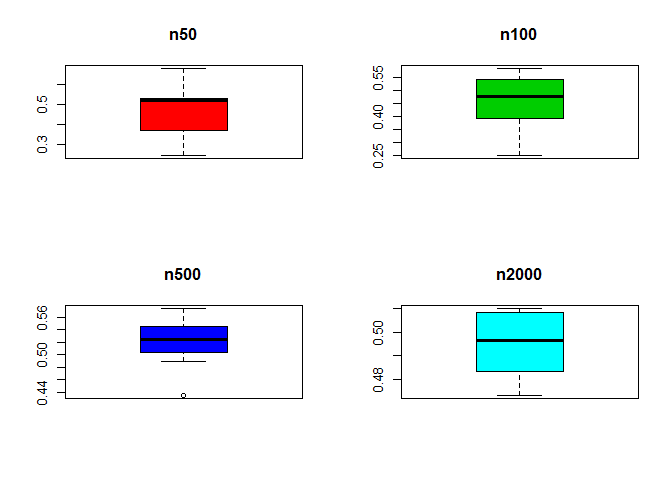

``` r
cbind(n50=mean(m1),n100=mean(m2),n500=mean(m3),n2000=mean(m4))
```

    ##            n50      n100      n500     n2000
    ## [1,] 0.4758731 0.4627588 0.5199346 0.4935495

Generating from a discrete distribution<br>
===========================================

``` r
x=c(0:5) #Discrete data
px=c(0.1, 0.2, 0.3, 0.3,0.05,0.05) #respective probabilities
  #dbinom(x,5,0.5)
cpx=cumsum(px) #distribution function
pr=0    #generated variable
ns=10            #No of simulation
for(i in 1:ns)
{
un=runif(1,0,1)
pr[i]= min(which(un<cpx))-1 
}
hist(pr)
```

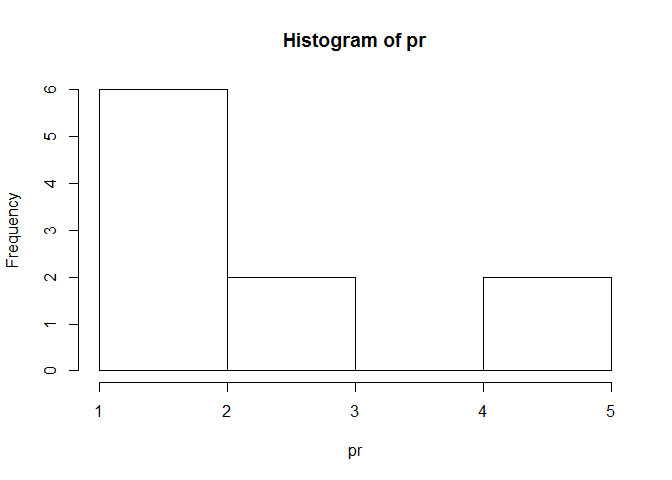

``` r
mean(pr)
```

    ## [1] 2.7

``` r
var(pr)
```

    ## [1] 1.788889

``` r
# check with
sum(x*px)
```

    ## [1] 2.15

``` r
sum(x^2*px)-sum(x*px)^2
```

    ## [1] 1.5275

Generating from a binomial distribution (BD) <br>
=================================================

checking with expectation formulas, simulated distribution in r and closed form formula for moments of BD

``` r
n=30 #binomial parameter - no of trials
p_g=0.05 #binomial parameter - proportion of success
x=c(0:n) #its range
px= dbinom(x,n,p_g) #respective probabilities
cpx=cumsum(px) #distribution function
# or cpx=pbinom(x,n,p_g)
pr=0    #generated variable
ns=100            #No of simulation
for(i in 1:ns)
{
  un=runif(1,0,1)
  pr[i]= min(which(un<cpx))-1 
}
hist(pr)
```

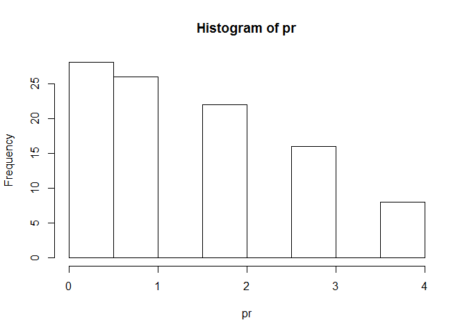

``` r
sim_u=cbind(mean(pr),var(pr)) #User simulation
# check with expectation formulas
formu=cbind(sum(x*px),sum(x^2*px)-sum(x*px)^2)
#or check with simulated distribution in r
sim_r=cbind(mean(rbinom(1000,n,p_g)),var(rbinom(1000,n,p_g)))
#or check with closed form formula for moments of BD
cld=cbind(n*p_g,n*p_g*(1-p_g))
res=rbind(sim_u,formu,sim_r,cld)
row.names(res)=c("sim_u","formula","sim_r","ClosedForm")
colnames(res)=c("mean","var")
res
```

    ##             mean      var
    ## sim_u      1.500 1.626263
    ## formula    1.500 1.425000
    ## sim_r      1.596 1.387386
    ## ClosedForm 1.500 1.425000

Inverse CDF or Inverse transform method - Generating from arbitrary distribution
================================================================================

``` r
require(pracma)
f1<-function(y) {(2/3)*(y+1)} #Range of the RV is LL and UL
LL = 0
UL = 1
aa=seq(LL,UL,by=0.0001) 
k1=length(aa)
s=0
for(i in 1:k1)
{
  s[i]=integral(f1,0,aa[i])
}
rs=0
ns=10
for(j in 1:ns)
{
  qu=runif(1,0,1)      #Required percentile
  ep=0.0000001 #Required Precision
  qq=max(which(s-qu < ep))
  rs[j]=aa[qq] #req_percentile
}
hist(rs)
```

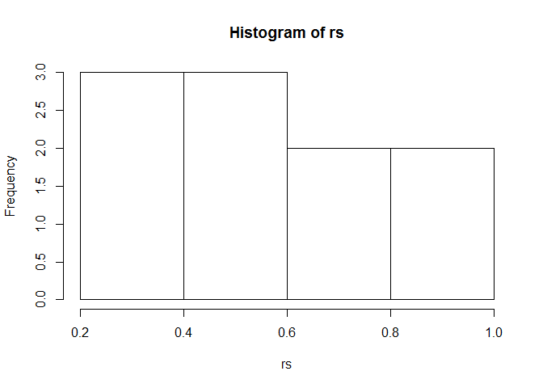

``` r
sim_u=cbind(mean(rs),var(rs)) #User simulation
# check with expectation formulas
fm1= function(y) {y*(y+1)*(2/3)}
fm2= function(y) {y^2*(2/3)*(y+1)}
mo1=integral(fm1,LL,UL)
mo2=integral(fm2,LL,UL)
va=mo2-mo1^2
formu=cbind(mo1,va)
res=rbind(sim_u,formu)
row.names(res)=c("sim_u","formula")
colnames(res)=c("mean","var")
res
```

    ##              mean        var
    ## sim_u   0.5688400 0.07209129
    ## formula 0.5555556 0.08024691

Inverse CDF or Inverse transform method - Generating from arbitrary distribution - Triangle<br>
===============================================================================================

``` r
require(pracma)
f1<-function(y) {y} #Range of the RV is LL and UL
LL1 = 0
UL1 = 1
f2<-function(y) {2-y} 
LL2 = 1
UL2 = 2
aa=seq(LL1,UL2,by=0.001) 
k1=length(aa)
s=0
for(i in 1:k1)
{
  if(aa[i]<1)
  {
    s[i]=integral(f1,0,aa[i])
  } else
  {
    s[i]=integral(f1,0,UL1)+integral(f2,1,aa[i])
  }
}
rs=0
ns=1000
for(j in 1:ns)
{
  qu=runif(1,0,1)      #Required percentile
  ep=0.0000001 #Required Precision
  qq=max(which(s-qu < ep))
  rs[j]=aa[qq] #req_percentile
}
sim_u=cbind(mean(rs),var(rs)) #User simulation
# check with expectation formulas
fm11= function(y) {y*f1(y)}
fm12= function(y) {y*f2(y)}
fm21= function(y) {y^2*f1(y)}
fm22= function(y) {y^2*f2(y)}
mo1=integral(fm11,LL1,UL1)+integral(fm12,LL2,UL2)
mo2=integral(fm21,LL1,UL1)+integral(fm22,LL2,UL2)
va=mo2-mo1^2
formu=cbind(mo1,va)
res=rbind(sim_u,formu)
row.names(res)=c("sim_u","formula")
colnames(res)=c("mean","var")
res
```

    ##             mean       var
    ## sim_u   0.991185 0.1752227
    ## formula 1.000000 0.1666667

``` r
par(mfrow=c(1,2))
curve(f1,0,1,xlim=c(LL1,UL2))
curve(f2,1,2,add=TRUE)
hist(rs)
```

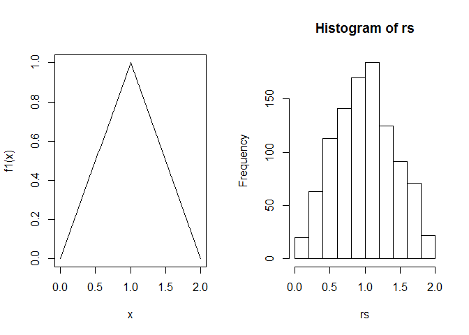

Inverse CDF or Inverse transform method - Generating from beta distribution<br>
===============================================================================

``` r
require(pracma)
a=2
b=5
f1<-function(q) {(1/beta(a,b))*q^(a-1)*(1-q)^(b-1)}
aa=seq(0,1,by=0.00001)
k1=length(aa)
s=0
for(i in 1:k1)
{
  s[i]=integral(f1,0,aa[i])
}
rs=0
ns=1000
for(j in 1:ns)
{
qu=runif(1,0,1)      #Required percentile
ep=0.0000001 #Required Precision
qq=max(which(s-qu < ep))
rs[j]=aa[qq] #req_percentile
}
hist(rs)
```

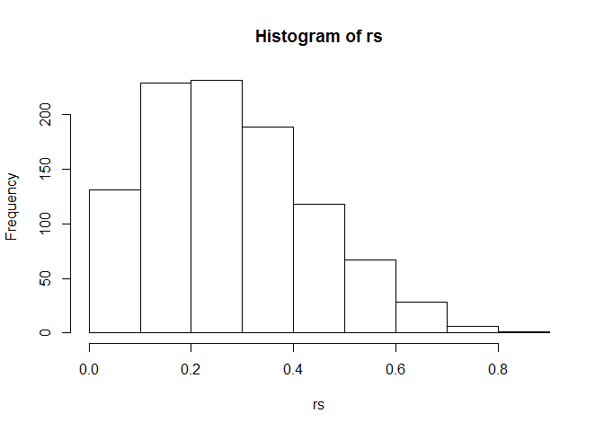

``` r
sim_u=cbind(mean(rs),var(rs)) #User simulation
# check with expectation formulas
fm1= function(y) {y*(1/beta(a,b))*y^(a-1)*(1-y)^(b-1)}
fm2= function(y) {y^2*(1/beta(a,b))*y^(a-1)*(1-y)^(b-1)}
mo1=integral(fm1,0,1)
mo2=integral(fm2,0,1)
va=mo2-mo1^2
formu=cbind(mo1,va)
#or check with simulated distribution in r
sim_r=cbind(mean(rbeta(1000,a,b)),var(rbeta(1000,a,b)))
#or check with closed form formula for moments of BD
cld=cbind(a/(a+b),a*b/((a+b)^2*(a+b+1)))
res=rbind(sim_u,formu,sim_r,cld)
row.names(res)=c("sim_u","formula","sim_r","ClosedForm")
colnames(res)=c("mean","var")
res
```

    ##                 mean        var
    ## sim_u      0.2788847 0.02432527
    ## formula    0.2857143 0.02551020
    ## sim_r      0.2909683 0.02661963
    ## ClosedForm 0.2857143 0.02551020
